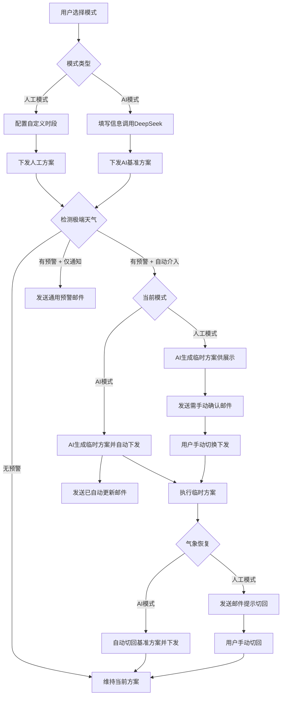

## 1. 产品概述

AI智能灌溉是一款面向家庭/园艺用户的智能浇灌控制前端系统，通过对接 DeepSeek 大模型与和风天气预警 API，提供「人工自定义」与「AI 常规智能」两种浇灌模式，并在极端天气场景下自动或半自动地调整浇水方案，同时通过 MQTT 实时下发至硬件设备执行。

- 核心目标：让用户既能完全掌控浇灌计划，也能借助 AI 生成科学方案；在极端天气来临时保障植物存活，气象恢复后无缝切回原方案。
- 目标用户：家庭园艺爱好者、阳台种植用户、小型温室管理者。
- 市场价值：降低智能灌溉的使用门槛，将 AI 能力与气象感知融合进日常浇水场景，兼顾自动化与用户掌控权。

## 2. 核心功能

### 2.1 用户角色

| 角色 | 注册方式 | 核心权限 |
|------|----------|----------|
| 单用户（本地部署） | 无需注册，直连后端 | 全部功能：配置、方案管理、下发、预警、测试面板 |

### 2.2 功能模块

1. **总览页**：当前执行方案卡片、设备在线状态、今日浇水时间轴、最新预警摘要。
2. **基础配置页**：植物信息、地域、场景（室内/室外）、预警开关层级、当前模式选择、邮箱配置。
3. **人工方案页**：时段列表新增/删除/编辑、单次浇水量与时间配置、永久人工基准说明。
4. **AI方案页**：植物/地域/养护信息填写、一键生成 AI 基准方案、方案预览与下发。
5. **临时方案页**：极端天气触发的临时方案列表、人工模式一键切换下发、状态标识。
6. **预警历史页**：预警记录分页列表、alert/cancel 类型区分、详情查看。
7. **测试面板页**：模拟预警发送、模拟天气恢复、设备状态实时查看、快捷下发按钮。

### 2.3 页面详情

| 页面名称 | 模块名称 | 功能描述 |
|----------|----------|----------|
| 总览页 | 当前方案卡片 | 显示当前执行方案类型（人工/AI/临时）、方案名称、今日时段数、总浇水量 |
| 总览页 | 设备状态 | 在线/离线指示灯、最后心跳时间、最近一次上报 payload |
| 总览页 | 今日时间轴 | 横向时间轴展示今日浇水时段、当前时间标记、已完成/待执行状态 |
| 总览页 | 最新预警 | 最近 3 条预警摘要、点击跳转预警历史 |
| 基础配置页 | 植物信息 | 植物名称、品种、种植阶段输入 |
| 基础配置页 | 地域位置 | 城市名输入 + 城市查询联想下拉、室内/室外场景切换 |
| 基础配置页 | 预警开关 | 预警通知开关、自动介入开关（依赖预警通知，室内场景禁用） |
| 基础配置页 | 模式选择 | 当前执行模式切换（人工/AI），影响下发与极端天气处理逻辑 |
| 基础配置页 | 邮箱配置 | 接收预警邮件的邮箱地址 |
| 人工方案页 | 时段列表 | 已配置浇水时段卡片列表，含开始时间、浇水量、操作按钮 |
| 人工方案页 | 新增时段 | 时间选择器 + 水量输入 + 保存 |
| 人工方案页 | 下发按钮 | 一键将人工方案下发至硬件 |
| AI方案页 | AI输入表单 | 植物、地域、养护备注、场景（联动基础配置） |
| AI方案页 | 生成按钮 | 调用 DeepSeek 生成基准方案，展示多时段结果 |
| AI方案页 | 方案预览 | 生成的 AI 方案时段卡片、总浇水量统计 |
| AI方案页 | 下发按钮 | 一键将 AI 方案下发至硬件 |
| 临时方案页 | 临时方案列表 | 历史临时方案分页表格，含预警类型、状态、生效区间 |
| 临时方案页 | 一键切换 | 人工模式下，对已生成的临时方案提供「切换并下发」按钮 |
| 预警历史页 | 预警表格 | 分页表格，列：预警类型、等级、消息类型、时间、详情 |
| 预警历史页 | 详情弹窗 | 展示预警完整描述文本与起止时间 |
| 测试面板页 | 模拟预警表单 | 预警类型、等级、持续时长、描述文本输入 + 发送按钮 |
| 测试面板页 | 模拟恢复 | 一键模拟极端天气结束，触发恢复原方案 |
| 测试面板页 | 设备状态 | 实时在线状态、心跳时间、payload 展示 |
| 测试面板页 | 快捷下发 | 当前方案一键下发按钮 |

## 3. 核心流程

### 3.1 人工模式 + 自动介入 + 极端天气

用户配置人工方案并下发 → 系统检测到极端天气 → AI 生成适配推荐临时方案展示在前端 → 发送专属预警邮件提示用户手动确认 → 用户在临时方案页点击「切换并下发」→ 硬件执行临时方案 → 气象恢复后发送邮件提示切回原方案（不自动替换）→ 用户手动切回人工方案。

### 3.2 AI 模式 + 自动介入 + 极端天气

用户填写信息 → AI 生成基准方案并下发 → 系统检测到极端天气 → AI 生成临时方案并自动切换下发 → 发送专属预警邮件告知已自动更新 → 气象恢复后自动切回 AI 基准方案并下发 → 推送恢复提醒邮件。

### 3.3 仅预警通知（无自动介入）

两种模式下，系统仅推送通用预警邮件，不生成临时方案，不改动浇水任务。

### 3.4 室内场景特殊规则

室内场景下无气象预警相关逻辑（预警开关、自动介入均禁用），AI 生成方案时自动下调浇水量适配室内环境。

## 4. 界面设计

### 4.1 设计风格

- **主色调**：深绿（#0F3D2E）与炭灰（#1A1F1B）为底，叶绿（#7FB069）与水蓝（#5BA7D4）为强调色，暖米色（#E8E4D9）为文字主色。
- **按钮风格**：胶囊形圆角，主操作按钮使用叶绿渐变 + 微妙阴影，次要按钮使用透明描边。
- **字体**：标题使用 Fraunces（衬线显示字体，带自然有机感），正文使用 Manrope（现代无衬线，可读性高），数字使用等宽变体。
- **布局风格**：左侧固定导航栏 + 右侧卡片式内容区，玻璃拟态卡片（backdrop-blur + 半透明边框），背景含叶脉纹理与渐变光斑。
- **图标风格**：lucide-react 线性图标，圆润笔触，与有机自然主题契合。
- **动效**：framer-motion 实现页面切换淡入、卡片悬停上浮、状态指示灯呼吸、数据加载骨架屏。

### 4.2 页面设计概览

| 页面名称 | 模块名称 | UI 元素 |
|----------|----------|----------|
| 总览页 | 当前方案卡片 | 玻璃卡片、叶绿渐变角标、大号 Fraunces 字号显示方案类型、recharts 时间轴 |
| 总览页 | 设备状态 | 圆形指示灯（在线叶绿呼吸/离线灰红）、等宽数字时间戳 |
| 总览页 | 今日时间轴 | 横向 recharts 时间轴、当前时间竖线、已完成节点实心、待执行节点空心 |
| 基础配置页 | 配置表单 | 分组卡片、开关组件（warn/介入联动禁用）、城市联想输入 |
| 基础配置页 | 场景切换 | 室内/室外分段控制器、室内时预警区域灰显禁用 |
| 人工方案页 | 时段卡片 | 网格布局卡片、时间圆形徽章、水量进度条、删除悬浮确认 |
| AI方案页 | 生成结果 | 加载骨架屏动画、AI 图标水印、方案卡片瀑布流 |
| 临时方案页 | 方案表格 | 紧凑表格、状态色标（生效中叶绿/已失效灰）、操作列按钮 |
| 预警历史页 | 预警列表 | 分页表格、等级色标（红/橙/黄）、消息类型 tag |
| 测试面板页 | 模拟表单 | 代码编辑器风格输入区、发送按钮带状态反馈、控制台日志输出区 |

### 4.3 响应式

- 桌面优先设计（1280px+ 完整三栏布局）。
- 平板（768-1280px）导航栏折叠为图标条，卡片单列。
- 移动端（<768px）底部标签栏导航，卡片全宽堆叠，触摸优化按钮尺寸（min 44px）。

### 4.4 3D 场景指引

本项目不涉及 3D 场景。
