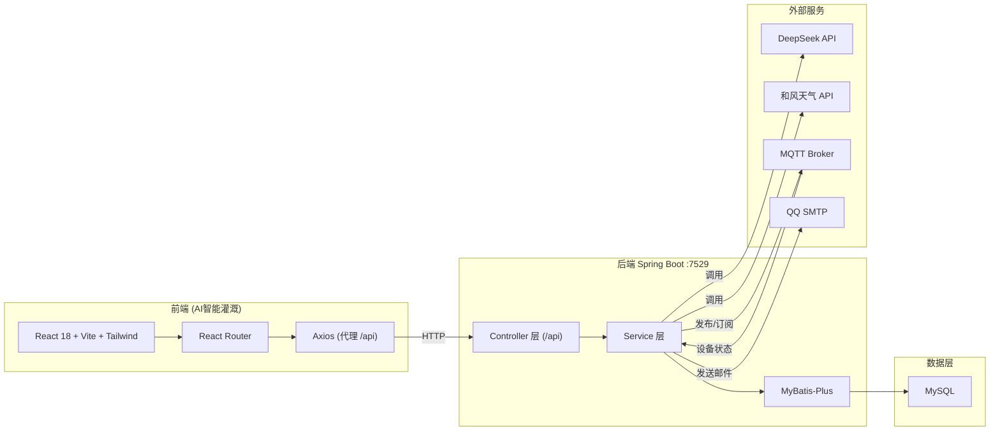
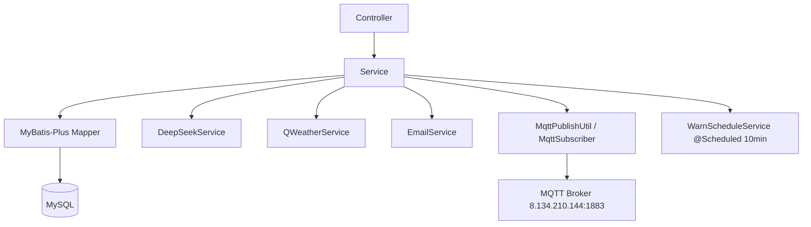
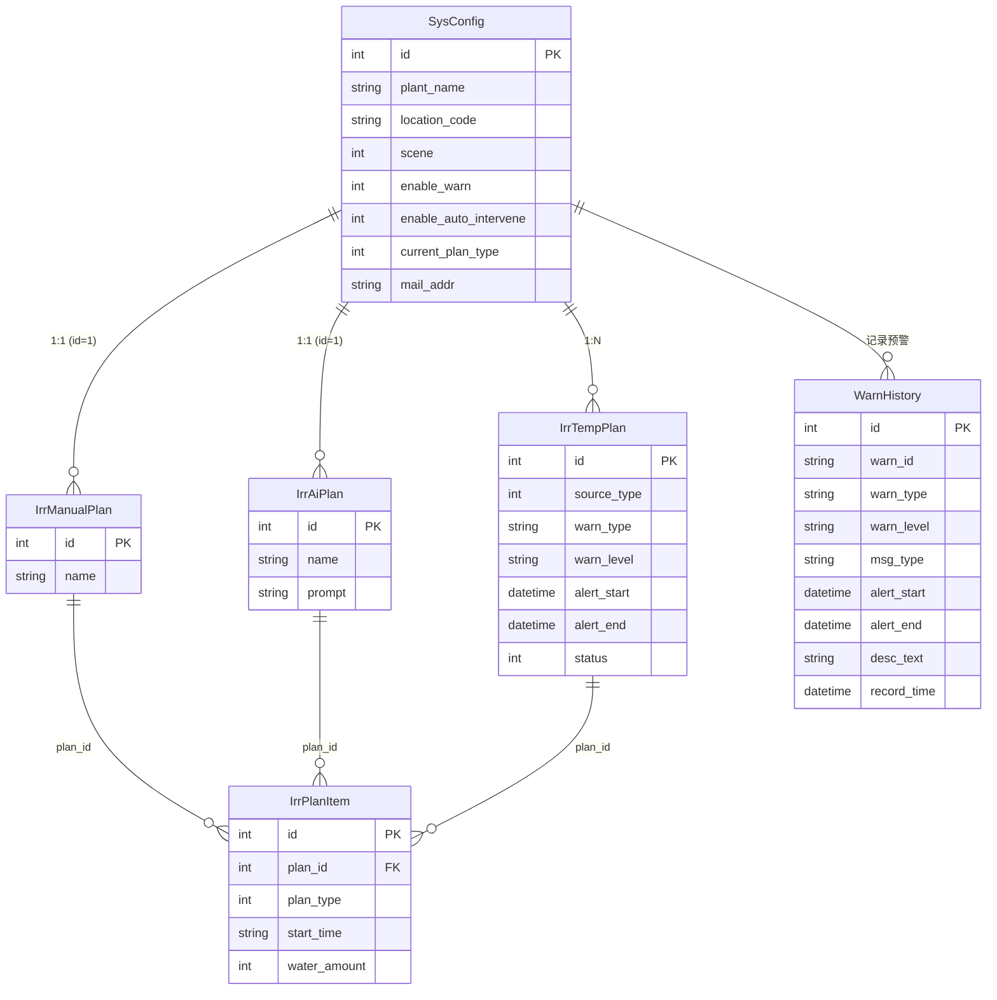

## 1. 架构设计



## 2. 技术栈说明

- **前端框架**：React@18 + Vite@5
- **样式方案**：Tailwind CSS@3 + CSS 变量主题
- **路由**：React Router@6
- **HTTP 客户端**：Axios（开发环境通过 Vite proxy 代理 `/api` → `http://localhost:7529`）
- **动画**：framer-motion
- **图标**：lucide-react
- **图表**：recharts
- **初始化工具**：vite-init（`npm create vite@latest`）
- **后端**：已存在的 Spring Boot 2.7（端口 7529，context-path=/api），无需新建
- **数据库**：已存在的 MySQL，由后端 MyBatis-Plus 管理，前端不直接访问

## 3. 路由定义

| 路由 | 用途 |
|------|------|
| `/` | 总览页：当前方案、设备状态、今日时间轴、最新预警 |
| `/config` | 基础配置页：植物信息、地域、场景、预警开关、模式选择、邮箱 |
| `/manual` | 人工方案页：时段增删改、下发 |
| `/ai` | AI方案页：信息填写、生成、预览、下发 |
| `/temp` | 临时方案页：列表、一键切换下发 |
| `/warn` | 预警历史页：分页列表、详情 |
| `/test` | 测试面板页：模拟预警、模拟恢复、设备状态 |

## 4. API 定义

所有 API 均在 `/api` 前缀下，开发环境由 Vite 代理转发。

### 4.1 基础配置

```typescript
// GET /api/sysConfig/get
interface SysConfig {
  id: number;
  plantName: string;        // 植物名称
  plantType: string;        // 品种
  locationCode: string;     // 城市名/代码
  scene: number;            // 1=室内 2=室外
  enableWarn: number;       // 0=关 1=开
  enableAutoIntervene: number; // 0=关 1=开（依赖 enableWarn）
  currentPlanType: number;  // 1=人工 2=AI 3=临时
  mailAddr: string;
  remark: string;
}

// GET /api/sysConfig/cityLookup?name=xxx
interface CityLookupVO { id: string; name: string; adm: string; country: string; }

// POST /api/sysConfig/add | /update
type SysConfigReq = Partial<SysConfig>;
```

### 4.2 人工方案 / AI方案 / 临时方案

```typescript
interface PlanItem {
  id: number;
  planId: number;
  planType: number;  // 1人工 2AI 3临时
  startTime: string; // HH:mm
  waterAmount: number; // 毫升
}

// POST /api/irrManualPlan/get -> IrrManualPlan { id, name, items: PlanItem[] }
// POST /api/irrManualPlan/add | /update
// POST /api/irrAiPlan/generate -> 调用 DeepSeek 生成并返回 IrrAiPlan
// POST /api/irrAiPlan/get
// POST /api/irrTempPlan/list -> { records: IrrTempPlan[], total }
// POST /api/irrTempPlan/list/page -> { records, total, current, size }
interface IrrTempPlan {
  id: number;
  sourceType: number;   // 来源方案类型
  warnType: string;
  warnLevel: string;
  alertStart: string;
  alertEnd: string;
  status: number;       // 1=生效 2=失效
  createTime: string;
  items: PlanItem[];
}
```

### 4.3 方案下发

```typescript
// POST /api/irrPlan/publish  (body: 无，按 current_plan_type 下发)
// POST /api/irrPlan/activateTemp?tempPlanId=xxx  (人工模式一键切换临时方案)
```

### 4.4 预警与测试

```typescript
// POST /api/warn/simulate
interface WarnSimulateRequest {
  warnType: string;
  warnLevel: string;
  durationMinutes: number;
  descText: string;
}
// POST /api/warn/simulateClear

// POST /api/warnHistory/list/page -> { records: WarnHistory[], total }
interface WarnHistory {
  id: number;
  warnId: string;
  warnType: string;
  warnLevel: string;
  msgType: string;  // alert / cancel
  alertStart: string;
  alertEnd: string;
  descText: string;
  recordTime: string;
}
```

### 4.5 设备状态

```typescript
// GET /api/device/status
interface DeviceStatusVO {
  online: boolean;
  lastSeen: number;    // 时间戳
  lastPayload: string;
}
```

## 5. 服务端架构图



## 6. 数据模型

### 6.1 数据模型定义



### 6.2 数据定义语言

数据表由后端已存在的 MySQL DDL 管理，前端不直接建表。关键表结构概要：

- `sys_config`：单行配置表（id 固定=1），存储全局配置与当前方案类型。
- `irr_manual_plan`：单行人工基准方案（id 固定=1）。
- `irr_ai_plan`：单行 AI 基准方案（id 固定=1）。
- `irr_temp_plan`：多行临时方案，`status` 1=生效 2=失效，`source_type` 记录原方案类型。
- `irr_plan_item`：多行时段明细，`plan_type` 区分归属（1人工/2AI/3临时），`plan_id` 关联对应方案表。
- `warn_history`：多行预警记录，`msg_type` 区分 alert/cancel。

## 7. 前端项目目录结构

```
AI智能灌溉/
├── index.html
├── package.json
├── vite.config.ts
├── tailwind.config.js
├── postcss.config.js
├── tsconfig.json
├── src/
│   ├── main.tsx
│   ├── App.tsx
│   ├── index.css
│   ├── api/
│   │   ├── request.ts          # axios 实例
│   │   ├── config.ts           # 配置相关接口
│   │   ├── plan.ts             # 方案相关接口
│   │   ├── warn.ts             # 预警/测试相关接口
│   │   └── device.ts           # 设备状态接口
│   ├── components/
│   │   ├── Layout.tsx          # 侧边栏布局
│   │   ├── PlanCard.tsx        # 方案卡片
│   │   ├── PlanItemCard.tsx    # 时段卡片
│   │   ├── DeviceStatusBadge.tsx
│   │   └── Skeleton.tsx
│   ├── pages/
│   │   ├── Overview.tsx        # 总览
│   │   ├── Config.tsx          # 基础配置
│   │   ├── ManualPlan.tsx      # 人工方案
│   │   ├── AiPlan.tsx          # AI方案
│   │   ├── TempPlan.tsx        # 临时方案
│   │   ├── WarnHistory.tsx     # 预警历史
│   │   └── TestPanel.tsx       # 测试面板
│   ├── hooks/
│   │   └── usePolling.ts       # 轮询 hook
│   ├── types/
│   │   └── index.ts            # TS 类型定义
│   └── utils/
│       └── format.ts           # 时间/水量格式化
└── .gitignore
```

## 8. 开发与运行

- 开发命令：`npm run dev`（Vite 默认端口 5173）
- 构建命令：`npm run build`
- 代理配置：`vite.config.ts` 中 `server.proxy['/api'] = 'http://localhost:7529'`
- 启动前置：后端 Spring Boot 已运行于 7529 端口，MySQL 已就绪。
